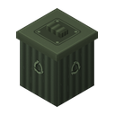
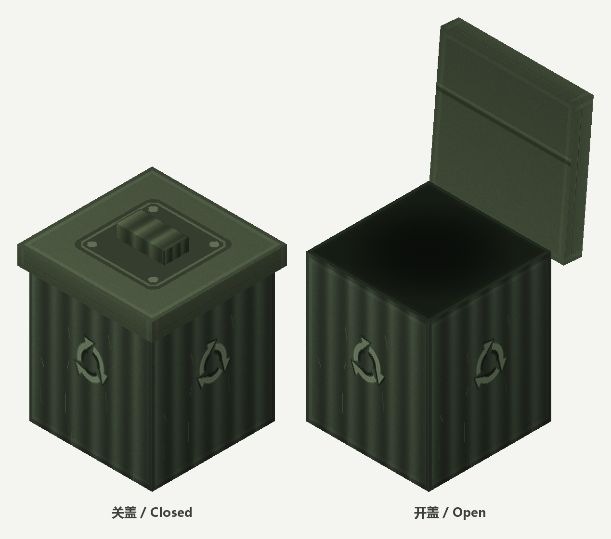

# Dustbin-Mod




> 掉落物不再无声消失 —— 它们会滑进一个共享的垃圾桶。  
> Dropped items no longer vanish silently — they slide into a shared trash bin.

一个 **Minecraft 26.2** 的模组：原版里掉落物 5 分钟后直接消失；这个模组把它改成：**掉落物在设定时间后进入垃圾桶**，你随时可以把东西捡回来。

A mod for **Minecraft 26.2**: in vanilla, dropped items despawn after 5 minutes. This mod changes that — items are moved into a trash bin after a configurable delay, and you can take them back out whenever you like.



*左：关盖 · 右：开盖（95°）。此图由方块模型离线渲染，不含游戏内光影。*  
*Left: closed · Right: open at 95°. Rendered offline from the block model — no in-game lighting.*

---

## 支持的模组端 / Supported loaders

| 模组端 Loader       | 状态 Status                | 产物 Artifact                    |
| ---------------- | ------------------------ | ------------------------------ |
| Fabric           | 可用 / Available           | `dustbin-fabric-<version>.jar` |
| Forge / NeoForge | 尚未支持 / Not yet supported | —                              |

模组身份标识（mod id）是 `dustbin`，**不随模组端变化**；只有产物文件名带模组端后缀。这样把世界从 Fabric 构建切换到其他模组端时，存档里的垃圾桶与桶内物品可以原样保留。

The mod id is `dustbin` and **stays the same across loaders**; only the artifact filename carries a loader suffix. That way, moving a world from the Fabric build to another loader keeps every trash bin and its contents intact.

---

## 功能 / Features

### 掉落物进桶 / Items drop into the bin

- 物品存活时间达到阈值后自动收入垃圾桶，原版的 5 分钟消失逻辑被取消。  
  Items are collected as soon as they reach the configured age; vanilla's 5-minute despawn is cancelled.
- 阈值默认 **10 分钟**，可调范围 **1 ~ 1440 分钟**。  
  The default threshold is **10 minutes**, adjustable between **1 and 1440 minutes**.
- 垃圾桶已满时（54 格全占、且没有同类物品所在格），物品**回落到原版行为**正常消失 —— 它是兜底，不是无限仓库。  
  When the bin is full (all 54 slots taken, with no slot holding the same item), items **fall back to vanilla despawn** — the bin is a safety net, not unlimited storage.

### 54 格共享存储 / 54 slots, shared storage

| 规则 Rule | 说明 Description |
| --- | --- |
| 同一维度内共享 / Shared per dimension | 同一维度内所有垃圾桶共用同一份存储，不是每个方块各存一份。Every bin in a dimension reads the same storage — not one per block. |
| 一种物品只占一格 / One item type per slot | 相同 id + 组件视为同种，绝不跨格堆放。Matching id + components count as one type, and never span slots. |
| 每格上限 = 物品自身上限 / Per-slot cap = the item's own cap | 鸡蛋 16、石头 64、工具 1。Eggs 16, stone 64, tools 1. |
| 超出部分直接丢弃 / Overflow is discarded | 已存 64 个石头时再来 65 个 → 只保留 64，多出的丢掉。65 stone on top of 64 stored → keep 64, discard the rest. |

### 只取不放 / Take-only GUI

GUI 是 6×9 的标准箱子布局，但**所有格子都禁止放入**物品（拖入、Shift 点击均无效）。想往桶里塞东西只有一条路：把物品丢在地上等它自己进去。

The GUI is a standard 6×9 chest layout, but **item placement is blocked in every slot** (drag and shift-click alike). The only way to put something in is to drop it on the ground and let it walk in by itself.

### 开盖动画 / Animated lid

打开界面时桶盖掀起，关闭时合上（ESC、走远、死亡、切换维度都会触发）。盖子由 BlockEntityRenderer 逐帧插值渲染，不是瞬间切换。

The lid lifts when the GUI opens and folds back when it closes (ESC, walking away, dying, or changing dimension). The lid is interpolated frame-by-frame by a BlockEntityRenderer — not an instant state swap.

### 指令 / Commands

| 指令 Command | 作用 Description |
| --- | --- |
| `/dustbin clear` | 清空垃圾桶，反馈清掉的物品组数。Empty the bin; reports how many stacks were cleared. |
| `/dustbin settime <minutes>` | 设置收集阈值，范围 1 ~ 1440 分钟。Set the collection threshold (1–1440 minutes). |

权限：单人世界的房主可直接使用；多人服务器需要管理员权限。

Permissions: singleplayer hosts can use them directly; multiplayer servers require admin permission.

---

## 合成 / Crafting

8 个铁锭围 1 个箱子 / 8 iron ingots around 1 chest:

```
I I I
I C I
I I I
```

`I` = 铁锭 / Iron Ingot ・ `C` = 箱子 / Chest

---

## 安装 / Installation

当前仅有 Fabric 构建，步骤如下：

Only a Fabric build is available for now:

1. 安装 **Fabric Loader ≥ 0.19.3** 与 **Fabric API**  
   Install **Fabric Loader ≥ 0.19.3** and **Fabric API**
2. 把 `dustbin-fabric-1.0.0.jar` 放进 `mods/`  
   Put `dustbin-fabric-1.0.0.jar` into `mods/`
3. 需要 **Java 25**  
   Requires **Java 25**

---

## 兼容性 / Compatibility

**Minecraft** 26.2 ・ **Java** ≥ 25 ・ **Fabric Loader** ≥ 0.19.3（当前构建 / current build）

Fabric 构建通过 Mixin 注入 `ItemEntity#tick`。与其他同样改写掉落物消失逻辑的模组同时使用时**可能冲突**，建议实测。

The Fabric build mixes into `ItemEntity#tick`. It **may conflict** with other mods that rewrite item despawn behaviour — test it before shipping it in a pack.

---

## 行为细节与已知限制 / Behaviour and known limitations

- **物品年龄只在所在区块被加载时增长。** 长期未加载的区块里的掉落物不会"到点进桶"，直到有人靠近。  
  **Item age only advances while the chunk is loaded.** Items in unloaded chunks will not be collected until a player comes back.
- **开盖角度 95°，盖子几乎竖直立在桶后，垂直占用超出方块本身。** 按模型几何实测：盖顶伸到方块顶面**上方约 0.37 格**，所以正上方紧贴方块时必然穿模；盖沿向后探出约 **0.035 格**，把角度压到 85° 以内即可消除。但即便压到 60°，盖顶仍有约 0.33 格高 —— 开盖的垂直占用无法靠调角度规避，只能靠留空解决。  
  **The lid opens to 95°**, standing almost vertically behind the bin, so it occupies space above the block. Measured from the model geometry: the lid top reaches about **0.37 blocks above** the block's top face, so a block directly overhead is always clipped; the tab juts roughly **0.035 blocks** rearward, which disappears once the angle drops below 85°. Even at 60°, though, the lid still stands about 0.33 blocks tall — the vertical footprint of an open lid cannot be designed away by lowering the angle, only accommodated by leaving headroom.
- **存储按维度保存在世界数据里。** 移除本模组后，数据文件仍留在存档中但不再被读取。  
  **Storage is saved per dimension** in the world data. If you remove the mod, the data file stays in the save but is never read again.

---

## 参与开发 / Contributing

欢迎提交 Issue 与 Pull Request。

Issues and pull requests are welcome.

构建 / Build:

```bash
./gradlew build
```

产物位于 `build/libs/dustbin-fabric-1.0.0.jar`。

The artifact lands in `build/libs/dustbin-fabric-1.0.0.jar`.

---

## 许可证 / License

[CC BY-NC-SA 4.0](LICENSE) —— 允许使用、修改与再分发，但**必须署名**、**不得用于商业用途**，且衍生作品需以相同协议共享。

[CC BY-NC-SA 4.0](LICENSE) — use, adaptation and redistribution are permitted, provided you **give attribution**, **do not use it commercially**, and **share derivatives under the same license**.
